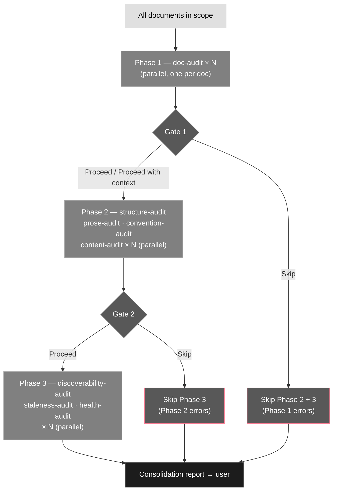
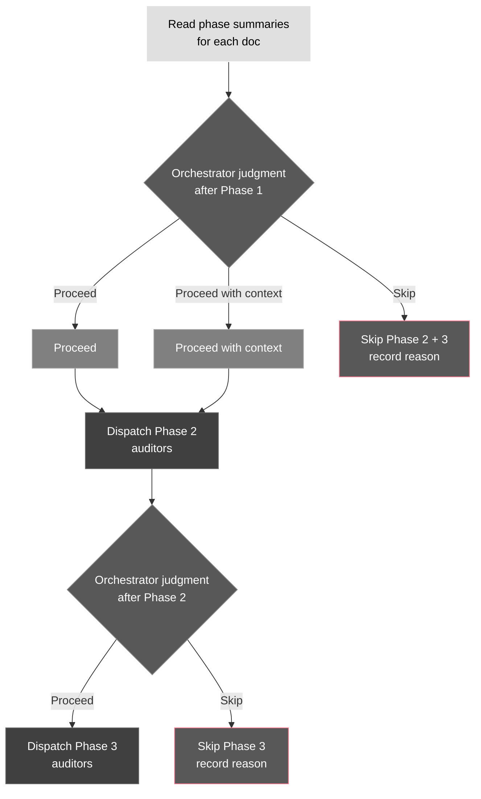
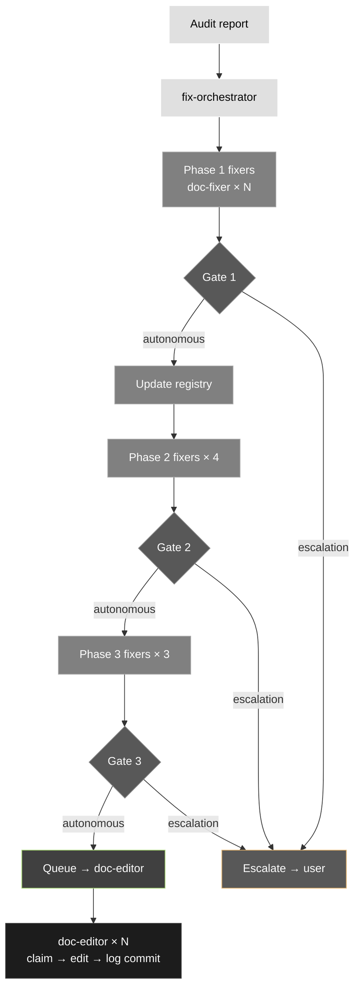
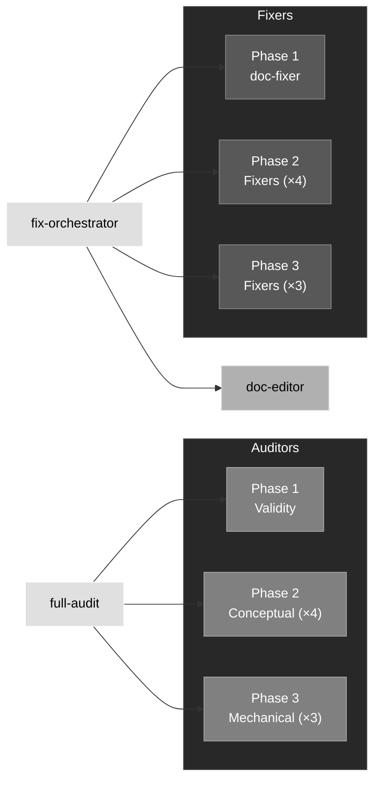

# Design: Specialised Audit + Fix Agent Architecture

## Problem

The current `full-audit` agent is monolithic, slow to run, hard to extend, and unreliable as a
source of actionable findings.

**The audit is too coarse.** `doc-lint` performs 7 unrelated checks in a single agent. Checks
requiring judgment (prose quality, section structure) run alongside purely mechanical checks (file
sizing, broken references). Different expertise, different guides, different fix strategies —
combining them produces an agent that does none well.

**The audit wastes work.** Cross-file concerns are interleaved with file-level checks, so every
agent reads every file even when most are clean. No gate between phases — a document that should
be deleted still gets its prose audited.

**The audit has gaps.** Prose style and section structure quality are not checked at all.
Document validity — does this doc need to exist, is it placed correctly, does its outline make
sense — is never evaluated before line-level checks begin.

**The fix pipeline doesn't exist.** The orchestrator applies fixes inline, mixing audit and
repair, with no plan presented to the user and no parallelism. Fixes are applied immediately and
irreversibly.

**The source of truth is wrong.** `doc-lint` reads `auditing-anti-patterns.md` as its primary
source. The guides define what good looks like — auditors should derive their checks from guides
directly. `auditing-anti-patterns.md` is a diagnostic lens on the same content, not the canonical
specification.

---

## Goals

- Auditors specialised by concern type, running in parallel, each reading the guide that governs
  their domain
- A three-phase audit pipeline: document validity → conceptual quality → mechanical correctness,
  with an orchestrator gate between phases
- A matching fix pipeline where fixers classify their own findings (fixable, scope, reversible)
  and the orchestrator decides autonomously or escalates — no work done on unapproved changes
- A file-based handoff protocol so agents communicate through structured reports, not inline
  output — enabling parallelism and keeping the orchestrator's context clean
- A concurrency-safe claim protocol so multiple `doc-editor` instances execute fixes in parallel
  without stepping on each other

---

## The Two-Lens Principle

The guides and `auditing-anti-patterns.md` cover the same content from opposite directions:

- **Guides** — prescriptive. "Here is what good looks like and how to achieve it." This is the
  canonical source of truth.
- **`auditing-anti-patterns.md`** — diagnostic. "Here is what wrong looks like and how to detect
  it."

Auditing agents read the guides — not `auditing-anti-patterns.md` — to derive their checks. If a
quality criterion exists in a guide but not in `auditing-anti-patterns.md`, the auditor catches it
anyway. `auditing-anti-patterns.md` serves the orchestrator's high-level understanding of audit
philosophy; it links to guides as reference depth.

---

## Audit Pipeline

### Three phases

**Phase 1 — Document validity (parallel, one `doc-audit` instance per doc)**

Examines each document as a whole unit — does not descend to line level. Checks: existence
rationale, purpose clarity, correct bucket placement, filename, outline coherence, high-level
framework compliance. Findings tell Phase 2 agents what to focus on.

**Phase 2 — Conceptual depth (parallel, informed by Phase 1)**

Specialist auditors examine each document's substance. Each reads the guide governing its domain.

Agents: `structure-audit`, `prose-audit`, `convention-audit`, `content-audit`

**Phase 3 — Mechanical checks (parallel, deterministic)**

Agents that run scripts or apply fixed rules — no judgment required.

Agents: `discoverability-audit`, `staleness-audit`, `health-audit`

### Three-phase audit pipeline



### Auditor report format

All auditors use the same two-part structure: finding blocks followed by a phase summary. The
auditor reports what it found; the orchestrator applies gate logic.

**Finding block** (one per finding):

```
[CHECK N — CHECK NAME]
Severity: Error | Warning | Info
Doc-ID: <doc-id>
Found: One or two sentences describing exactly what is wrong — quote the relevant content
  or heading where useful.
Impact: One sentence on why this matters.
Recommendation: Concrete — name the target location, the correct filename, the missing
  section. The orchestrator uses this to brief the fixer and, for escalations, the user.
```

**Phase summary** (one per report, at the end):

```
PHASE SUMMARY
Doc-ID: <doc-id>
Phase: <1 | 2 | 3> — <auditor name>
Findings: <N errors, N warnings, N info>
Context: <One sentence the next phase should know — document type, apparent purpose,
  any placement or scope issues that affect what the next phase should focus on.
  Omit if there are no findings.>
```

The `Context` line is optional — include it when findings would meaningfully focus the next
phase's checks. If no findings: output `Document passed all checks.` followed by the phase
summary with `Findings: 0 errors, 0 warnings, 0 info` and no `Context` line.

### Orchestrator gates

The orchestrator reads phase summaries and decides whether to proceed. It does not read project
files — all signal flows through reports. Errors inform the decision but do not mechanically
determine it; the orchestrator may proceed through a gate even with errors present if doing so
provides useful additional context.

A report missing its `PHASE SUMMARY` block, or with an unparseable one, is treated as an agent
failure — not a clean pass. The orchestrator excludes that doc from further phases and surfaces it
in the consolidation report under `Agent failure`. This catches truncated writes without requiring
checksums.

- **After Phase 1:** Read each `doc-audit` summary. Decide per-doc: proceed (with or without
  context) or skip Phase 2 and 3.
- **After Phase 2:** Read all four Phase 2 summaries per doc. Decide: proceed to Phase 3 or skip.



### Audit data flow

```
full-audit
  │  generates run-id, builds registry, passes both to all agents
  │
  ├── Phase 1 — document validity (parallel, one instance per doc):
  │   └── doc-audit × N     → .vyasa/<run-id>/reports/phase-1/doc-audit/<doc-id>.md
  │
  ├── [orchestrator gate]
  │   reads phase-1 reports — decides per-doc: Proceed | Proceed with context | Skip
  │
  ├── Phase 2 — conceptual depth (parallel, informed by Phase 1 reports):
  │   ├── structure-audit   → .vyasa/<run-id>/reports/phase-2/structure-audit/<doc-id>.md
  │   ├── prose-audit       → .vyasa/<run-id>/reports/phase-2/prose-audit/<doc-id>.md
  │   ├── convention-audit  → .vyasa/<run-id>/reports/phase-2/convention-audit/<doc-id>.md
  │   └── content-audit     → .vyasa/<run-id>/reports/phase-2/content-audit/<doc-id>.md
  │
  ├── [orchestrator gate]
  │   reads phase-2 reports — decides per-doc: Proceed | Skip
  │
  ├── Phase 3 — mechanical checks (parallel, deterministic):
  │   ├── discoverability-audit → .vyasa/<run-id>/reports/phase-3/discoverability-audit/<doc-id>.md
  │   ├── staleness-audit       → .vyasa/<run-id>/reports/phase-3/staleness-audit/<doc-id>.md
  │   └── health-audit          → .vyasa/<run-id>/reports/phase-3/health-audit/<doc-id>.md
  │
  └── consolidation:
      orchestrator reads all reports — deduplicates, ranks by severity → single report → user
```

### `full-audit` workflow

**Step 1 — Startup**

Generate a run ID and create the run directory:

```bash
run_id=$(openssl rand -hex 4)
mkdir -p .vyasa/${run_id}/reports
```

Enumerate all `.md` files under the project root, excluding `.vyasa/`, `plugin/`,
`node_modules/`, `.git/`. Assign each a stable `doc-id` (`doc-001`, `doc-002`, …) in
alphabetical order by path. Write the registry to `.vyasa/<run-id>/registry.json`, then
immediately re-read and parse it — if the parse fails (truncated write, empty file), abort,
delete the run directory, and report the error. Do not proceed with an unverified registry.

**Step 2 — Phase 1 (parallel)**

Dispatch one `doc-audit` per document with `doc-id` and `run-id`. Wait for all to complete.

**Step 3 — Gate after Phase 1**

Read every report in `.vyasa/<run-id>/reports/phase-1/doc-audit/`. Retain each `Context` line
for use in Step 4. Decide per-doc:

- Proceed → include in Phase 2 dispatch list, no context needed
- Proceed with context → include in Phase 2 dispatch list; use the `Context` line in Step 4
- Skip → exclude from Phase 2 and 3; record the skip reason in the consolidation report

**Step 4 — Phase 2 (parallel)**

Dispatch all four Phase 2 auditors for each doc not skipped, passing `doc-id` and `run-id`.
When Phase 1 produced a `Context` line, synthesise a terse, targeted briefing per agent — distil
the signal relevant to that agent and discard the rest. Do not pass the context line verbatim.

Example: Phase 1 flagged a doc as likely a decision record placed in `docs/guides/`. Briefing
for `structure-audit`: "Possible decision record in guides/ — check if structure matches decision
record template." Briefing for `prose-audit`: "Audience may be mixed — check if tone shifts
between sections." Different signal, same source.

Wait for all 4 × N instances to complete.

**Step 5 — Gate after Phase 2**

Read all four Phase 2 summaries per doc. Decide per-doc: proceed to Phase 3 or skip (record
reason).

**Step 6 — Phase 3 (parallel)**

Dispatch all three Phase 3 auditors for each doc not skipped with `doc-id` and `run-id`. Wait
for all 3 × N instances to complete.

**Step 7 — Consolidation**

Read all reports across all phases. Output a single report to the user (not written to a file):

1. **Per-document summary table** — doc-id, phase-1 result, phase-2 findings count, phase-3
   findings count, overall severity (highest across phases)
1. **All findings, ranked by severity** — Errors, then Warnings, then Info; within each tier
   grouped by document; each finding includes agent, phase, finding text, recommendation
1. **Skipped documents** — with reason
1. **Overall health summary** — `Healthy` (zero errors, ≤3 warnings), `Needs Attention` (any
   warnings, no errors), `Critical` (any errors)

The orchestrator does not apply fixes. After the report it asks: "Would you like me to run the
fix pipeline?" and dispatches `fix-orchestrator` only if the user confirms. `fix-orchestrator`
auto-discovers the run from `.vyasa/` — no run-id handoff needed.

### `full-audit` workflow sequence

```mermaid
graph LR
    s1["Step 1<br/>Generate run-id<br/>Build registry"]
    s2["Step 2<br/>Dispatch Phase 1<br/>doc-audit × N"]
    s3["Step 3<br/>Gate — read<br/>phase-1 reports"]
    s4["Step 4<br/>Dispatch Phase 2<br/>4 auditors × N"]
    s5["Step 5<br/>Gate — read<br/>phase-2 reports"]
    s6["Step 6<br/>Dispatch Phase 3<br/>3 auditors × N"]
    s7["Step 7<br/>Consolidate<br/>→ report to user"]

    s1 --> s2 --> s3 --> s4 --> s5 --> s6 --> s7

    style s1 fill:#e0e0e0,stroke:#ffffff,color:#000000
    style s2 fill:#808080,stroke:#a8a8a8,color:#ffffff
    style s3 fill:#585858,stroke:#888888,color:#ffffff
    style s4 fill:#808080,stroke:#a8a8a8,color:#ffffff
    style s5 fill:#585858,stroke:#888888,color:#ffffff
    style s6 fill:#808080,stroke:#a8a8a8,color:#ffffff
    style s7 fill:#1c1c1c,stroke:#383838,color:#ffffff
```



---

## Fix Pipeline

### Structure

Fix phases mirror audit phases. Each doc enters the fix pipeline at the phase where its earliest
findings are — a doc with no Phase 1 findings skips `doc-fixer` entirely. Phase 1 fixes must
complete before Phase 2 fixers run on the same doc, because Phase 1 problems (wrong location,
wrong purpose) change what Phase 2 checks are relevant.

Fixers classify each finding and produce a concrete recommendation. The orchestrator gates;
`doc-editor` executes.

### Fixer report format

All fixers use the same `FINDING` block and `FIXER SUMMARY` format as `doc-fixer`. The blocking
field is uniform:

```
Next-phase wait: yes | no
  If yes: one sentence explaining what the next phase must wait for and why.
```

Phase 3 fixers always write `Next-phase wait: no`.

### Fixer classification contract

Each fixer returns a classification for every finding:

| Field        | Values                               | Meaning                                                   |
| ------------ | ------------------------------------ | --------------------------------------------------------- |
| `fixable`    | `yes` / `no`                         | Can this finding be resolved without user input           |
| `scope`      | `file` / `multi-file` / `structural` | How many files the fix touches                            |
| `reversible` | `yes` / `no`                         | Whether the change can be undone with a single git revert |

### Phase 2 fixer classification tables

The tables below define the baseline for each Phase 2 fixer — override with judgment when a
specific case changes the classification.

**`prose-fixer`** (findings from `prose-audit`):

| Finding                                      | fixable | scope | reversible | Reason                                   |
| -------------------------------------------- | ------- | ----- | ---------- | ---------------------------------------- |
| Missing table intro sentence                 | yes     | file  | yes        | Adding 1 line before a table             |
| Sentence fragment in prose                   | yes     | file  | yes        | Rewriting 1–2 lines in one file          |
| Passive voice                                | yes     | file  | yes        | Rewriting affected sentences in one file |
| Missing contraction (where tone requires it) | yes     | file  | yes        | Word-level edit in one file              |
| Non-parallel list items                      | yes     | file  | yes        | Rewriting list items in one file         |

All `prose-fixer` findings are autonomous — prose edits are always file-scoped and reversible.

**`structure-fixer`** (findings from `structure-audit`):

| Finding                                                | fixable | scope | reversible | Reason                                                              |
| ------------------------------------------------------ | ------- | ----- | ---------- | ------------------------------------------------------------------- |
| Missing or malformed scoped opening                    | yes     | file  | yes        | Adding 1–2 lines after the H1                                       |
| When-before-how ordering violated                      | yes     | file  | yes        | Reordering existing sections in one file                            |
| Missing example section                                | yes     | file  | yes        | Adding a skeleton section to one file                               |
| Missing prerequisite / consequences section            | yes     | file  | yes        | Adding a skeleton section to one file                               |
| Major task-oriented restructure (whole-doc flow wrong) | no      | —     | —          | Requires judgment about what moves where; downstream refs may break |

**`convention-fixer`** (findings from `convention-audit`):

| Finding                                              | fixable | scope | reversible | Reason                                                                        |
| ---------------------------------------------------- | ------- | ----- | ---------- | ----------------------------------------------------------------------------- |
| Convention missing negative constraint               | yes     | file  | yes        | Rewriting the phrasing in one file                                            |
| Tool-generic rule (delete from AGENTS.md)            | yes     | file  | yes        | Deleting one line from one file                                               |
| Linter-enforceable rule — linter already configured  | yes     | file  | yes        | Deleting the written rule; tool config already covers it                      |
| Linter-enforceable rule — linter not yet configured  | no      | —     | —          | Requires adding tool config + deleting rule; user decides which tool and rule |
| Aspirational convention (codebase doesn't follow it) | no      | —     | —          | User must decide: enforce via linter, fix the code, or delete                 |

**`content-fixer`** (findings from `content-audit`):

| Finding                                                             | fixable | scope      | reversible | Reason                                                               |
| ------------------------------------------------------------------- | ------- | ---------- | ---------- | -------------------------------------------------------------------- |
| Verbatim duplication >3 lines — delete duplicate, link to canonical | yes     | multi-file | yes        | Remove block from one file, add link; canonical home is clear        |
| Semantic duplication — same concept in different words              | no      | —          | —          | Requires judgment on which version is canonical and what to keep     |
| Misplaced content passage — target file exists                      | yes     | multi-file | yes        | Extract block, insert into target file, add link                     |
| Misplaced content passage — target file does not exist              | no      | —          | —          | Creating a new file is a structural decision; user decides           |
| Convention drift — doc contradicts current practice                 | no      | —          | —          | User must decide which is correct: update the doc or update the code |

### Orchestrator gates (fix pipeline)

After each fixer phase the orchestrator routes findings:

- `fixable: yes` + `scope: file or multi-file` + `reversible: yes` → queue for `doc-editor`, no
  user approval needed
- `scope: structural`, `fixable: no`, or `reversible: no` → escalate to user

For escalations the orchestrator surfaces: what the problem is, what the options are, whether
inbound references are affected, and what reversibility looks like. No work is done until the user
responds.

### Fix data flow



### `fix-orchestrator` workflow

**Step 1 — Startup**

`fix-orchestrator` accepts an optional `run-id` argument. If omitted, discover the run:

1. List directories under `.vyasa/`, sort by modification time newest-first.
1. Select the newest with a `registry.json` and at least one report under `reports/phase-1/`.

Print: `Using audit run <run-id> (<N> docs, <N> findings).` — then proceed without waiting.

If no valid run is found, stop and tell the user to run `full-audit` first.

Read `registry.json` and the auditor reports from all three phases to build a per-doc,
per-phase findings index. Documents with zero findings are skipped entirely.

**Step 2 — Phase 1 fixers (parallel)**

Dispatch one `doc-fixer` per doc with phase-1 findings. Wait for all to complete.

**Step 3 — Gate 1**

Route findings into two buckets:

- **Autonomous** (`fixable: yes`, `scope: file or multi-file`, `reversible: yes`) — queue for
  `doc-editor`
- **Escalations** — batch into a single message to the user; wait for response before continuing

After all escalations are resolved, update `current_path` in the registry for approved renames
or moves.

**Step 4 — Phase 2 fixers (parallel)**

Dispatch all four Phase 2 fixers per eligible doc. For docs where the Phase 1 fixer report
includes `Next-phase wait: yes`, hold dispatch until those tasks appear as `committed` in the
claim log. Wait for all to complete.

**Step 5 — Gate 2**

Same routing as Gate 1: autonomous fixes queued, escalations batched and surfaced, registry
updated after resolution.

**Step 6 — Phase 3 fixers (parallel)**

Dispatch `discoverability-fixer`, `staleness-fixer`, and `health-fixer` per eligible doc. Wait
for all to complete.

**Step 7 — Gate 3 and execution**

Same routing as Gates 1 and 2. After escalations are resolved, dispatch `doc-editor` instances
in parallel — one per autonomous task. Tasks with a non-empty `depends_on` field wait until each
listed task ID appears as `committed` in the claim log.

**Step 8 — Completion**

Report to the user: tasks executed autonomously, escalations resolved, and any escalations
deferred by the user.

### `doc-editor` execution model

Each `doc-editor` instance handles exactly one task. It does not commit — the user commits when
satisfied. The pipeline's record of completion is the claim log.

Workflow:

1. Read `.vyasa/<run-id>/tasks/<task-id>.json`
1. Read `current_path` for each doc-id from `.vyasa/<run-id>/registry.json`
1. `vyasa-claim.sh claim <run-id> <agent> <doc-id> [<doc-id> ...]`
1. `vyasa-claim.sh confirm <run-id> <agent> <doc-id> [<doc-id> ...]` — exit 1 aborts and reports conflict
1. Apply all changes
1. `vyasa-claim.sh commit <run-id> <agent> <doc-id> [<doc-id> ...]`
1. Report done to the orchestrator

Multiple tasks targeting the same file run sequentially — enforced via `depends_on`: the second
task waits until the first records `committed` before claiming.

### Task structure

The orchestrator writes each task before dispatching `doc-editor`:

```
.vyasa/<run-id>/tasks/<task-id>.json
```

`doc-editor` receives only `task-id` and `run-id` and reads the task file itself — tasks are
inspectable and the dispatch message stays minimal.

| Field        | Description                                                               |
| ------------ | ------------------------------------------------------------------------- |
| `id`         | Unique task identifier                                                    |
| `doc-ids`    | Array of doc-ids from the registry (single-file tasks have one element)   |
| `finding`    | Audit agent + phase + severity + plain-language description               |
| `change`     | What to do — specific enough for `doc-editor` to execute without judgment |
| `depends_on` | Task IDs that must complete first (empty = start immediately)             |

**Multi-file fixes.** `doc-editor` claims all files it will touch before editing any of them,
applies all changes, then commits each claim. For small tightly coupled changes (e.g. rename +
routing table update) this is one task. Use two tasks with `depends_on` only when changes are
large or independent enough that sequencing adds clarity.

---

## Infrastructure

### Run ID

```bash
run_id=$(openssl rand -hex 4)
```

Produces 8 random hex characters — short enough to be readable in paths, random enough to avoid
collisions. Generated once and passed to every agent the orchestrator dispatches.

### Registry

The orchestrator enumerates all documents in scope at startup, assigns each a stable `doc-id`,
and writes:

```
.vyasa/<run-id>/registry.json
```

```json
{
  "doc-001": {
    "original_path": "docs/setup.md",
    "current_path": "docs/setup.md"
  },
  "doc-002": {
    "original_path": "docs/ErrorHandling_v2.md",
    "current_path": "docs/error-handling.md"
  }
}
```

`current_path` is updated by the orchestrator at each gate when a fixer recommends a rename or
move. Agents always read `current_path` — never `original_path`. The registry is
orchestrator-owned and only written between phases.

### File-based handoff

Agents write structured reports to well-known paths under `.vyasa/<run-id>/reports/`. The
orchestrator reads these reports for every gating and routing decision — it never reads project
files directly.

Each agent writes exactly one report to a path encoding both the auditor name and `doc-id`:

```
.vyasa/<run-id>/reports/phase-2/prose-audit/doc-001.md
```

No two agents ever write to the same path. The only shared write target is `changes.log`,
handled separately by the claim protocol.

### Claim protocol

Before editing any document, `doc-editor` must claim it. The claim log is append-only:

```
.vyasa/<run-id>/changes.log
```

Multiple doc-ids may be passed in a single call — all are claimed, confirmed, or committed as a
group, allowing `doc-editor` to claim all files in one step before editing any of them.

```bash
# 1. Claim all doc-ids the task will touch
vyasa-claim.sh claim   <run-id> <agent> <doc-id> [<doc-id> ...]

# 2. Confirm all claims are uncontested
vyasa-claim.sh confirm <run-id> <agent> <doc-id> [<doc-id> ...]
# exits 0 = all confirmed, proceed
# exits 1 = conflict on one or more, abort and report to orchestrator

# 3. Edit files directly — claims ARE the locks, no copies needed

# 4. Record completion
vyasa-claim.sh commit  <run-id> <agent> <doc-id> [<doc-id> ...]

# On abort:
vyasa-claim.sh release <run-id> <agent> <doc-id> [<doc-id> ...]
```

Log format — one JSON line per entry:

```
{"ts":<unix>,"run_id":"...","doc_id":"...","agent":"...","action":"claim|committed|released"}
```

POSIX guarantees that `write()` calls under `PIPE_BUF` bytes (at least 512, typically 4096) are
atomic when a file is opened with `O_APPEND`. The shell `>>` operator uses `O_APPEND`. A single
JSONL line is well under that limit, so concurrent appends produce complete, non-interleaved
lines. This holds on local filesystems (ext4, APFS, tmpfs); NFS and FUSE mounts are not supported
deployment targets for `.vyasa/`.

The primary correctness guarantee is the design constraint: the orchestrator never assigns the
same `doc-id` to two agents simultaneously. The `confirm` step is belt-and-suspenders — it scans
the log for a second `claim` on the same `doc-id` from a different agent and aborts if found. A
conflict indicates an orchestrator bug and fails loudly.

Auditors and fixers never claim — read-only and recommendation-only respectively. Only
`doc-editor` claims.

### Filesystem layout

```
.vyasa/                          — ephemeral, not committed to version control
  <run-id>/
    registry.json                — doc-id → path mapping (orchestrator-owned)
    changes.log                  — append-only claim log
    reports/
      phase-1/
        doc-audit/
          doc-001.md             — doc-audit report for doc-001
        doc-fixer/
          doc-001.md
      phase-2/
        structure-audit/
          doc-001.md
        prose-audit/
          doc-001.md
        ...
      phase-3/
        discoverability-audit/
          doc-001.md
        ...
    tasks/
      <task-id>.json             — one task file per doc-editor task (orchestrator-written)
```

---

## Agent Inventory

### Agent relationships



### Auditors

| Agent                   | Phase          | Reads                                                                                                          | Scope                                                                                                                                                                                                                        |
| ----------------------- | -------------- | -------------------------------------------------------------------------------------------------------------- | ---------------------------------------------------------------------------------------------------------------------------------------------------------------------------------------------------------------------------- |
| `doc-audit`             | 1 — validity   | `managing-project-information.md`, `writing-reference-docs.md`, `writing-agents-md.md`, `writing-layout-md.md` | Existence, purpose, placement, filename, outline, high-level framework compliance                                                                                                                                            |
| `structure-audit`       | 2 — conceptual | `writing-reference-docs.md`                                                                                    | Scoped openings, when-before-how ordering, task-oriented organisation, example coverage                                                                                                                                      |
| `prose-audit`           | 2 — conceptual | `writing-prose-style.md`                                                                                       | Table intro sentences, sentence fragments, active voice, contractions, parallel list items                                                                                                                                   |
| `convention-audit`      | 2 — conceptual | `writing-conventions.md`                                                                                       | Convention phrasing (what+where+not), aspirational rules, linter-enforceable rules                                                                                                                                           |
| `content-audit`         | 2 — conceptual | `managing-project-information.md`                                                                              | Duplication >3 lines, semantic duplication, convention drift, misplaced content (passages within a correctly-placed document that belong in a different bucket — distinct from `doc-audit`'s document-level placement check) |
| `discoverability-audit` | 3 — mechanical | `writing-agents-md.md`                                                                                         | Routing table completeness, 2-hop traces, orphan files, broken references                                                                                                                                                    |
| `staleness-audit`       | 3 — mechanical | `framework/guides/staleness.md`                                                                                | Broken path references, command existence, aspirational conventions, diagram accuracy, ADR status. Uses `Bash` for existence checks only — does not execute commands from `AGENTS.md`.                                       |
| `health-audit`          | 3 — mechanical | `writing-reference-docs.md`                                                                                    | File sizing (thin \<15 lines, bloated >200 lines), README quality                                                                                                                                                            |

### Fixers

| Agent                   | Phase          | Covers findings from    |
| ----------------------- | -------------- | ----------------------- |
| `doc-fixer`             | 1 — validity   | `doc-audit`             |
| `structure-fixer`       | 2 — conceptual | `structure-audit`       |
| `prose-fixer`           | 2 — conceptual | `prose-audit`           |
| `convention-fixer`      | 2 — conceptual | `convention-audit`      |
| `content-fixer`         | 2 — conceptual | `content-audit`         |
| `discoverability-fixer` | 3 — mechanical | `discoverability-audit` |
| `staleness-fixer`       | 3 — mechanical | `staleness-audit`       |
| `health-fixer`          | 3 — mechanical | `health-audit`          |

### Orchestrators and scribe

| Agent                    | Role                                                                                                                                                                                                                        |
| ------------------------ | --------------------------------------------------------------------------------------------------------------------------------------------------------------------------------------------------------------------------- |
| `full-audit` (rewritten) | Generates run-id, builds registry, dispatches audit phases, gates between phases, consolidates findings into severity-ranked report                                                                                         |
| `fix-orchestrator` (new) | Reads audit report, dispatches fix phases, gates between phases, routes autonomous fixes to `doc-editor`, escalates larger concerns to user, updates registry at each gate                                                  |
| `doc-editor` (new)       | Receives `task-id` and `run-id`. Reads the task file, claims files, applies changes, records completion in the claim log. One task per instance, no conflicts by design. Does not commit — the user commits when satisfied. |

### Agents retired, renamed, or kept

| Agent                | Fate                                    | Reason                                                                    |
| -------------------- | --------------------------------------- | ------------------------------------------------------------------------- |
| `doc-lint`           | Retired                                 | Checks distributed across specialist auditors in all three phases         |
| `two-hop-check`      | Renamed → `discoverability-audit`       | Scope unchanged; now Phase 3 mechanical                                   |
| `duplication-detect` | Absorbed into `content-audit`           | Duplication is one check among several conceptual content concerns        |
| `full-audit`         | Rewritten                               | Same trigger; now dispatches three-phase auditor pipeline                 |
| `agents-md-lint`     | Kept for hook-triggered single-file use | Convention checks also extracted to `convention-audit` for full-audit use |
| `diagram-lint`       | Kept for hook-triggered single-file use | Already well-scoped; diagram concerns handled separately                  |
| `doc-audit`          | New                                     | Phase 1 validity auditor                                                  |
| `doc-fixer`          | New                                     | Phase 1 validity fixer                                                    |
| `health-fixer`       | New                                     | Phase 3 fixer for `health-audit` findings (sizing, README quality)        |
| `fix-orchestrator`   | New                                     | Fix pipeline orchestrator                                                 |
| `doc-editor`         | New                                     | Scribe — executes one approved fix task                                   |

---

## Out of Scope

- `diagram-lint` and `diagram-author` — diagram concerns are handled separately and unchanged
- `write-agents-md`, `write-decision-record`, `write-reference-doc` — authoring agents, not auditors
- `doc-maintenance` — handles code-change-triggered doc updates; different trigger from the audit/fix pipeline
- Hook-triggered single-file linting (`agents-md-lint`, `diagram-lint`) — this design covers full-repo audit and fix flows only

---

## Implementation Progress

### Completed ✅

**Phase 1 Infrastructure (Batch 1)**

- ✅ `full-audit` agent — 7-step orchestrator rewritten to dispatch three-phase pipeline
- ✅ `doc-audit` agent — Phase 1 validity auditor (checks: existence, purpose, placement, filename, outline, framework)
- ✅ `scripts/audit/build-registry.py` — Document enumeration, alphabetical ordering, integrity verification
- ✅ `scripts/audit/parse-phase-summary.py` — PHASE SUMMARY extraction for gate decisions
- ✅ Test suite — 26 passing tests (registry, output format, integration, end-to-end)
- ✅ `docs/audit-infrastructure-phase-1.md` — Phase 1 components documentation

**Quality Assurance**

- ✅ Spec compliance review — 7 issues found and fixed
- ✅ Code quality review — 8 issues found and fixed
- ✅ All tests passing (26/26)

### Completed (continued) ✅

**Phase 2 Auditors (Batch 2)**

- ✅ `structure-audit` — Reading `writing-reference-docs.md`: scoped openings, when-before-how ordering, task orientation, examples
- ✅ `prose-audit` — Reading `writing-prose-style.md`: table intros, fragments, voice, contractions, parallelism
- ✅ `convention-audit` — Reading `writing-conventions.md`: convention phrasing, negative constraints, linter rules
- ✅ `content-audit` — Reading `managing-project-information.md`: duplication, semantic drift, misplaced passages
- ✅ `full-audit` Steps 4–7 — Phase 2/3 dispatch logic, Gate 2, Gate 3, consolidation report

**Phase 3 Auditors (Batch 2)**

- ✅ `discoverability-audit` — Renamed from `two-hop-check`, mechanical checks for routing tables and references
- ✅ `staleness-audit` — Path verification, command existence, diagram accuracy, ADR status
- ✅ `health-audit` — File sizing (thin \<15 lines, bloated >200 lines), README quality

### Completed (continued) ✅

**Agent Retirement and Cleanup (Batch 4)**

- ✅ Removed `doc-lint` (checks distributed to specialist auditors)
- ✅ Removed `duplication-detect` (absorbed into `content-audit`)
- ✅ Removed `two-hop-check` (renamed to `discoverability-audit`, already implemented)
- ✅ Rebuilt `plugin/` via `sync-plugin.sh` — all new agents included, retired agents removed
- ✅ Bumped plugin version to `0.2.0` (minor — significant new agent surface)

### Metrics

| Component               | Status                      | Tests     | Notes                                                     |
| ----------------------- | --------------------------- | --------- | --------------------------------------------------------- |
| Phase 1 Infrastructure  | ✅ Complete                 | 26/26     | Registry, doc-audit, orchestrator startup                 |
| Phase 2 Auditors        | ✅ Complete                 | 0/24      | 4 agents implemented; tests pending                       |
| Phase 3 Auditors        | ✅ Complete                 | 0/18      | 3 agents implemented; tests pending                       |
| full-audit Steps 4–7    | ✅ Complete                 | 0/—       | Phase 2/3 dispatch, gates, consolidation                  |
| Fix Pipeline (Batch 3)  | ✅ Complete                 | 0/30      | 8 fixers + doc-editor + claim protocol + fix-orchestrator |
| Agent Cleanup (Batch 4) | ✅ Complete                 | —/5       | Retired 3 agents, rebuilt plugin/, bumped to v0.2.0       |
| **Total**               | **✅ All batches complete** | **26/26** | Pipeline fully implemented                                |

### Next Steps

1. ~~**Implement Phase 2 and 3 auditors (Batch 2)**~~ — ✅ Done
1. ~~**Implement fix pipeline (Batch 3)**~~ — ✅ Done
1. ~~**Retire and cleanup (Batch 4)**~~ — ✅ Done
