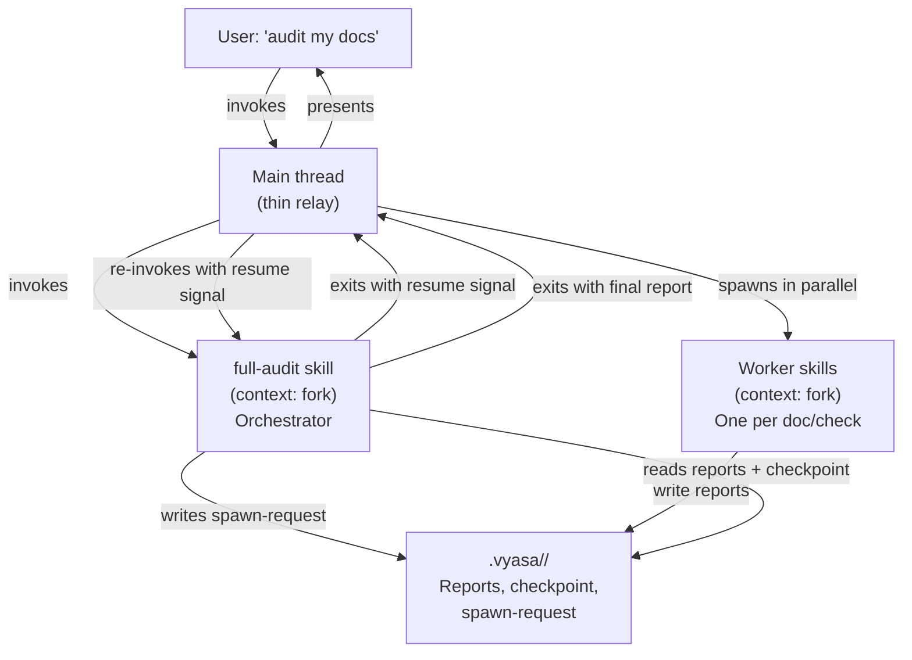

# Pipeline Orchestration Model Design

**Status:** Under Review
**Date:** 2026-03-08
**Author:** Engineering

The audit and fix pipelines need context isolation, specialised workers, and parallelism.
The current agent-based orchestrator model is broken because subagents cannot spawn other
subagents in Claude Code.

---

## Problem

The audit pipeline (`full-audit`) and fix pipeline (`fix-orchestrator`) are implemented as
subagents that dispatch worker subagents in parallel. This model fails at runtime: Claude
Code does not allow subagents to spawn other subagents. When `full-audit` runs as a
subagent and attempts to dispatch `doc-audit × N`, the spawning is silently misrouted —
Claude attempts to invoke workers as skills instead, which also fails because no matching
skills exist.

Beyond the spawning constraint, the pipeline has three additional requirements that the
current model does not satisfy:

1. **Context isolation between the main conversation and the pipeline.** The audit
   pipeline reads many documents, runs many checks, and produces verbose intermediate
   state. This must not accumulate in the user's main conversation context.

2. **Context isolation between workers.** A `doc-audit` instance checking `setup.md`
   should not see findings from the `doc-audit` instance checking `api.md`. Cross-worker
   noise degrades output quality and wastes tokens.

3. **Token efficiency.** Specialised workers should carry only the context relevant to
   their task. An auditor checking prose style does not need the full taxonomy guide; a
   validity checker does not need the prose style guide. Loading everything into every
   worker is expensive and degrades reasoning.

The root cause is that Claude Code's subagent model is a strict two-level hierarchy: the
main thread can spawn subagents; subagents cannot spawn further subagents. Any
orchestration pattern that requires a third level breaks.

---

## Alternatives considered

### Option A: Main-thread orchestration with forked worker skills

Convert all workers to skills with `context: fork`. The orchestrator runs inline in the
main conversation — it is a plain (non-forked) skill that the user invokes. The main
thread uses `TaskCreate` for parallel worker invocations. Each forked skill runs in
isolation.

**Pros:**

- Parallelism works natively via `TaskCreate` in the main thread
- Workers are fully isolated — each forked skill has its own context window
- `${CLAUDE_SKILL_DIR}` resolves paths natively; no injection script needed
- No spawning constraint — the main thread is not a subagent

**Cons:**

- The orchestrator accumulates context across all three phases in the main conversation.
  Phase 1 reads N reports, Phase 2 reads 4×N reports, Phase 3 reads 3×N reports — all in
  the same context window
- The user's main conversation is polluted with pipeline state for the duration of the run
- No resumability — if the orchestrator is interrupted mid-pipeline, there is no clean
  recovery path without manual intervention

### Option B: Forked orchestrator with file-based spawn handoff

The orchestrator runs as a `context: fork` skill (isolated subagent). Workers are also
forked skills. Since the orchestrator cannot spawn workers directly, it writes a
structured spawn-request file to disk and exits. The main thread reads the file, spawns
the requested workers in parallel, collects their results, and re-invokes the orchestrator
with a resume signal. The orchestrator reads its checkpoint file and continues from the
last gate.

**Pros:**

- Orchestrator context is fully isolated from the main conversation — the user sees only
  final results
- Workers are isolated from each other and from the orchestrator
- File-based checkpointing gives crash recovery: if the orchestrator is interrupted at any
  gate, the main thread can re-invoke it and it resumes from the last written checkpoint
- If re-invoked, a new orchestrator instance picks up from the checkpoint — no state is
  lost
- The main thread acts as a dumb spawner with no domain knowledge; all pipeline logic
  stays in the orchestrator

**Cons:**

- Each phase gate requires a round-trip: orchestrator exits → main thread spawns workers
  → main thread re-invokes orchestrator. Three phases means at minimum six
  main-thread interactions (spawn-request + resume per phase)
- The main thread must understand the spawn-request protocol to act on it — it is not
  truly invisible
- More moving parts: checkpoint files, spawn-request files, resume signals, re-invocation
  logic

### Option C: Subagent-as-orchestrator with direct skill dispatch (rejected during design)

The orchestrator is a subagent that dispatches workers by invoking skills via the Skill
tool. Forked skills are themselves subagents — so this is subagent spawning subagent.
Rejected immediately: Claude Code does not permit this. Included for completeness because
it was the original implementation intent.

---

## Recommendation

**Recommended: Option B — forked orchestrator with file-based spawn handoff**

Option A keeps the orchestrator in the main conversation, which defeats the context
isolation goal. As the pipeline processes more documents, the main thread accumulates all
phase reports, gate decisions, and briefings. This is precisely the problem we are solving.

Option B isolates the orchestrator and preserves all three requirements. The round-trip
cost is real but bounded — three phases means a fixed number of handoffs regardless of
document count. The main thread acts as a thin relay: it reads a spawn-request, invokes
the workers, and re-invokes the orchestrator. No pipeline logic lives in the main thread.

The file-based checkpoint is a genuine advantage over Option A: interrupted pipelines are
recoverable without re-running from scratch. Given that the audit pipeline can run for
several minutes across a large doc set, this matters operationally.

The deciding factor over Option A is the context isolation requirement. The orchestrator's
context window must not grow into the main conversation. Option B achieves this; Option A
does not.

---

## Design: Option B in detail

### Component model



### Skill types

| Role                                                   | Type                   | Isolation                                 | Path resolution       |
| ------------------------------------------------------ | ---------------------- | ----------------------------------------- | --------------------- |
| `full-audit`                                           | `context: fork` skill  | Isolated from main conversation           | `${CLAUDE_SKILL_DIR}` |
| `fix-orchestrator`                                     | `context: fork` skill  | Isolated from main conversation           | `${CLAUDE_SKILL_DIR}` |
| Worker auditors (`doc-audit`, `structure-audit`, etc.) | `context: fork` skills | Isolated from each other and orchestrator | `${CLAUDE_SKILL_DIR}` |
| Worker fixers (`doc-fixer`, `structure-fixer`, etc.)   | `context: fork` skills | Isolated from each other and orchestrator | `${CLAUDE_SKILL_DIR}` |

All agents become skills. No agent files remain.

### Spawn-request protocol

When the orchestrator needs workers spawned, it writes a spawn-request file before exiting:

```
.vyasa/<run-id>/spawn-request.json
```

```json
{
  "resume_after": "phase-1",
  "workers": [
    { "skill": "doc-audit", "args": "doc-id=doc-001 run-id=<run-id>" },
    { "skill": "doc-audit", "args": "doc-id=doc-002 run-id=<run-id>" }
  ]
}
```

The main thread reads this file, spawns all listed workers in parallel via `TaskCreate`,
waits for completion, then re-invokes `full-audit` with the resume signal:

```
/vyasa:full-audit resume run-id=<run-id>
```

The orchestrator reads its checkpoint, skips completed phases, and continues.

### Checkpoint protocol

The orchestrator writes a checkpoint after each gate decision:

```
.vyasa/<run-id>/checkpoint.json
```

```json
{
  "run-id": "<run-id>",
  "phase_completed": 1,
  "gate_1_decisions": { "doc-001": "proceed", "doc-002": "skip" },
  "phase_2_list": ["doc-001"]
}
```

On resume, the orchestrator reads the checkpoint and continues from `phase_completed + 1`.
If the checkpoint is absent or malformed, the orchestrator restarts from Phase 1.

### Features retained from agent model

| Feature                               | Agent model                                                        | Skill model                         |
| ------------------------------------- | ------------------------------------------------------------------ | ----------------------------------- |
| Context isolation (main conversation) | No — orchestrator runs as subagent in main thread if invoked wrong | Yes — `context: fork`               |
| Context isolation (between workers)   | Yes                                                                | Yes — each forked skill isolated    |
| Parallelism                           | Broken — subagents can't spawn subagents                           | Yes — main thread uses `TaskCreate` |
| Path resolution                       | Broken — `CLAUDE_PLUGIN_ROOT` not available in agent prompts       | Yes — `${CLAUDE_SKILL_DIR}`         |
| Resumability                          | No                                                                 | Yes — checkpoint file               |
| `color` per worker                    | Yes                                                                | No                                  |
| `model` per worker                    | Yes (`opus` for orchestrators)                                     | Inherits from parent                |
| `tools` restriction per worker        | Yes                                                                | Via `allowed-tools` frontmatter     |

`color` is lost. `model` per worker is lost — the orchestrator and all workers inherit the
model from the main conversation. `tools` restrictions are preserved via `allowed-tools`.

### Agent-to-skill migration

All 26 agent files in `plugin/agents/` are converted to skills in `plugin/skills/`. The
`@@VYASA_ROOT@@` template placeholder and `inject-vyasa-root.sh` are removed — replaced by
`${CLAUDE_SKILL_DIR}` which resolves natively. The `SessionStart` hook context message is
updated to reflect skill invocation.

---

## Open questions

- **How does the main thread know to read `spawn-request.json`?** The orchestrator must
  communicate this in its exit output. The exact prose the orchestrator should output to
  prompt the main thread to act needs to be specified. ~~Resolved: orchestrator exits with
  a structured message that the main thread parses.~~ _Still open — exact format TBD in
  spec._

- **What model do workers use?** With `model: inherit`, workers use whatever model the
  user is running. For `full-audit` this was previously `opus`. Do we need to enforce
  `opus` for the orchestrator via frontmatter, or is `inherit` acceptable? _Open — needs
  user decision._

- **Parallel skill invocation from main thread** — does `TaskCreate` work for forked
  skills invoked from the main thread, or only for background tasks? _Needs verification
  against Claude Code docs._

---

## Out of scope

- The fix pipeline (`fix-orchestrator`, `doc-editor`, fixers) — same pattern applies but
  migration is a separate implementation task
- The `author-*` and `agents-md-lint` standalone skills — not part of the pipeline, not
  affected by this change
- The `inject-vyasa-root.sh` mechanism and ADR 012 — superseded by this design if
  approved; cleanup is part of implementation
- Per-worker model selection — accepted loss; not addressed in this design

---

## Extracted artifacts

_Populated after approval._
